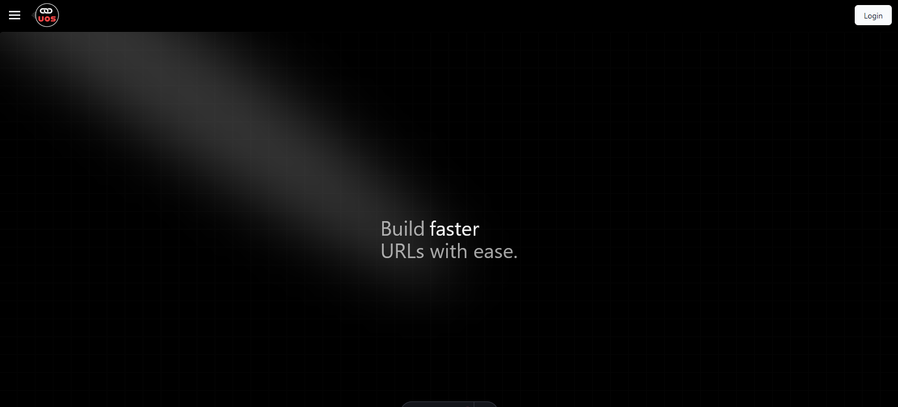

# UOS, URLs On Steroids 💉💉💉

### Table of Contents
1. [What is this?](#what-is-this)
2. [How to Use It?](#how-to-use-it)
3. [Tech Stack](#tech-stack)
4. [More Details](#more-details)
    - [Features](#features)
5. [Screenshots](#screenshots)
6. [License](#license)

---

### What is this?
UOS is a lightning-fast URL shortener designed to run on minimal resources. It’s fast, robust, and stable, making it perfect for high-performance needs.

---

### How to Use It?
You can either:
1. **Run the project locally:** Clone the repository and follow the setup instructions.
2. **Use the Docker file:** Simplify the setup process with Docker and get it running in no time.

---

### Tech Stack
**Frontend:**
- React
- Astro
- TailwindCSS
- Shadcn

**Backend:**
- Golang
- Fiber
- Redis
- PostgreSQL

---

### More Details
This is a canceled project I decided to open-source. The focus was initially on building a solid and efficient backend, but I eventually added a simple yet user-friendly frontend to turn it into a full application.

#### Features:
- OAuth login support for seamless authentication
- High-performance URL shortening
- Backend-first architecture with lightweight resource consumption
- Simple, clean UI

---

### Screenshots

---

### License
Feel free to use it however you want! If you like the project or find it helpful, just give me a mention in your work. :)  
